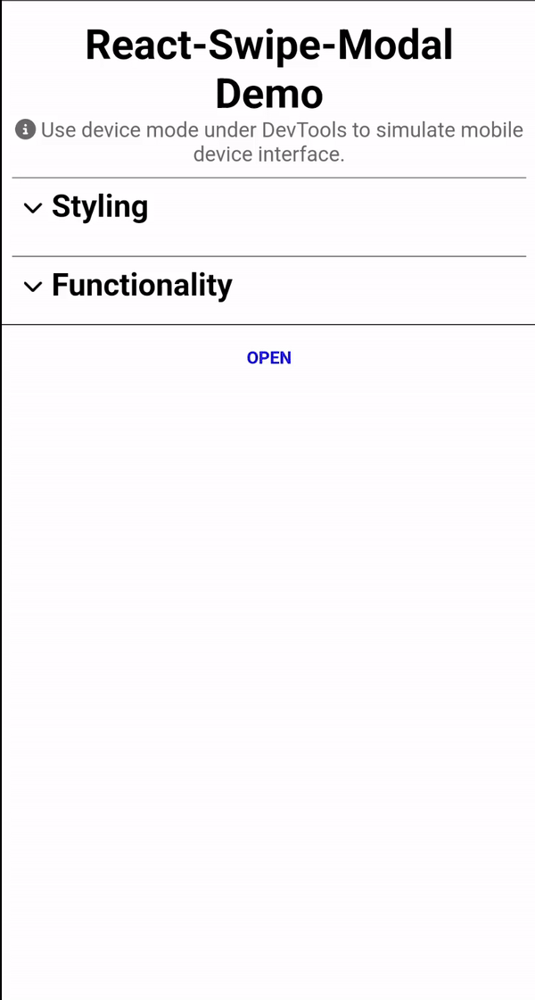

# React-Swipe-Modal

🌀 A swipeable modal for the browser, just like on your smartphone.

<div style="display: grid; grid-template-columns: 1fr 1fr; gap: 1rem">
    
    
</div>

## Features

- Swipe or tap to close
- Completely customizable appearance
- Different closing triggers and behaviours
- Display a react component inside the modal
- `onShow` and `onClose` hooks

## Demo


## Installation

```
npm i react-swipe-modal
```

## Usage

```jsx
import { useRef } from 'react';
import SwipeModal, { SwipeModalRef } from 'react-swipe-modal';

const App = () => {
    const modalRef = useRef<SwipeModalRef>(null);
    
    const showModal = () => modalRef.current?.show();

    return (
        <SwipeModal ref={modalRef}>
            Put anything inside here!
        </SwipeModal>
    );
};
```

# Props

 Name                       | Type                      | Default value | Description       
----------------------------|---------------------------|---------------|---------------------
 `children`                 | ReactNode\ReactNode[]     | **required**  | The content to be rendered inside the modal.
 **Styling**                |                           |               |
 `animationDuration`        | number                    | 300           | The duration of the modal's opening and closing animation in milliseconds.
 `backdropOpacity`          | number                    | 0.3           | The opacity of the modal's backdrop.
 `barColor`                 | string                    | 'dimgrey'     | The color of the bar at the top of the modal.
 `borderRadius`             | string                    | '1.2rem'      | The border radius of the modal.
 `hideBar`                  | boolean                   | false         | Set to `true` to hide the bar at the top of the modal.
 `maxWidth`                 | string                    | '100vw'       | The maximum width of the modal.
 `modalColor`               | string                    | 'black'       | The background color of the modal.
 **Functionality**          |                           |               |
 `closeTrigger`             | 'swipe'\|'height'         | 'swipe'       | The trigger to close the modal.<br>`'swipe'` means that modal will close when modal was swiped down faster than `closeTriggerSpeed`.<br>`'height'` means that modal will close when height of modal is less than `closeTriggerPercentage`.
 `closeTriggerPercentage`   | number                    | 50            | The height in percent that triggers the modal to close when using the `closeTrigger` `'height'`.
 `closeTriggerSpeed`        | number                    | 500           | The swipe speed in px/s that triggers the modal to close when using the `closeTrigger` `'swipe'`.
 `disableSwipe`             | boolean                   | false         | Set to `true` if you don't want to allow swiping.
 `swipeOnlyFromBar`         | boolean                   | false         | Set to `true` if you want to allow swiping only from the bar.
 **Additional Styling**     |                           |               |
 `backdropStyle`            | ViewStyle\|ViewStyle[]    |               | Additional styles to be applied to the backdrop.
 `barStyle`                 | ViewStyle\|ViewStyle[]    |               | Additional styles to be applied to the modal.
 `modalStyle`               | ViewStyle\|ViewStyle[]    |               | Additional styles to be applied to the modals.
 **Callbacks**              |                           |               |
 `onShow`                   | () => void                |               | A callback function that will be triggered when the modal is shown.
 `onHide`                   | () => void                |               | A callback function that will be triggered when the modal is closed.

## Public Methods

Name                  | Description
----------------------|--------------
`show()`                | Shows the modal.
`close()`                | Closes the modal.

## Contribute

Show your ❤️ and support by giving a ⭐. Any suggestions are welcome!

You can find more from me on my homepage [manuelpickl.com](https://manuelpickl.com/).

## License

Licensed under MIT